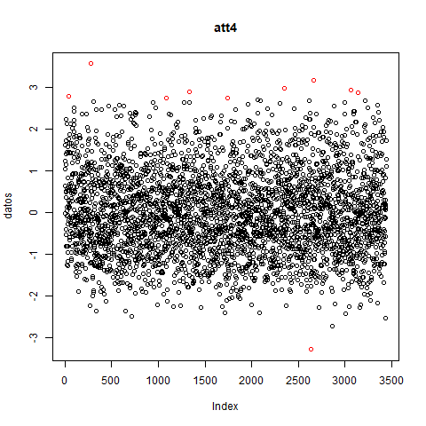
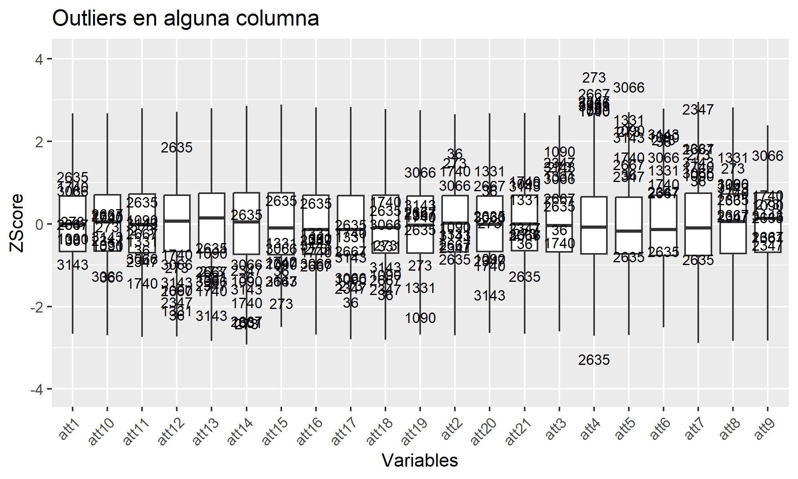
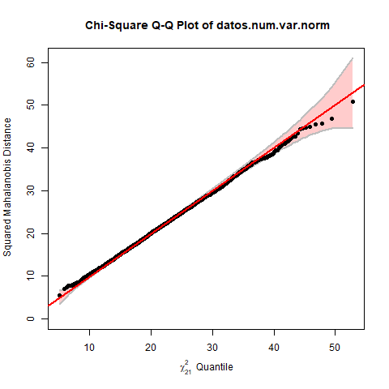
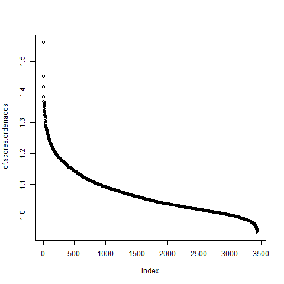

# Multivariate Anomaly Detection

Statistical and multivariate anomaly detection project using the Waveform dataset and techniques such as IQR, Grubbs test, Mahalanobis distance, LOF, and clustering-based methods.

---

## Overview

This project explores anomaly detection techniques applied to the Waveform dataset using both univariate and multivariate approaches.

The analysis includes statistical methods, graphical techniques, density-based approaches, and multivariate distance metrics in order to identify anomalous observations and understand their behavior across different variables.

Main components of the project include:

- Data preprocessing and exploratory analysis
- Univariate outlier detection using IQR
- Statistical hypothesis testing
- Normality analysis
- Multivariate anomaly detection
- Mahalanobis distance analysis
- LOF-based anomaly detection
- Clustering-based methods
- Analysis of pure multivariate outliers

---

## Dataset

The project uses the Waveform dataset, a synthetic dataset commonly employed for pattern recognition and statistical analysis tasks.

Dataset characteristics:

- Multiple numerical variables
- Synthetic Gaussian noise
- Complex multivariate relationships
- Presence of anomalous observations

The dataset was used to:

- Detect univariate outliers
- Analyze multivariate anomalies
- Compare statistical and distance-based methods
- Study pure multivariate outliers

---

## Methodology

The workflow included the following stages:

1. Data preprocessing
2. Univariate outlier detection using IQR
3. Statistical hypothesis testing
4. Normality analysis
5. Multivariate anomaly detection
6. Mahalanobis distance analysis
7. LOF-based anomaly detection
8. Clustering-based analysis
9. Analysis of pure multivariate outliers

### Statistical Analysis

The analysis pipeline included:

- Boxplot-based outlier detection
- Gaussian distribution analysis
- QQ plot analysis
- Distance-based anomaly scoring
- Density-based local anomaly detection
- Multivariate statistical interpretation

---

## Detection Methods

The project combines several anomaly detection approaches:

### Univariate Methods

- IQR-based outlier detection
- Grubbs hypothesis testing
- Graphical statistical analysis

### Multivariate Methods

- Mahalanobis distance
- LOF (Local Outlier Factor)
- Clustering-based anomaly detection

The project also studies pure multivariate anomalies, where an observation may not be anomalous in any individual variable but becomes anomalous when considering the global multivariate structure.

---

## Technologies

- R
- ggplot2
- outliers
- stats
- cluster
- factoextra
- MVN

---

## Evaluation Criteria

The analysis focused on:

- Detection of extreme observations
- Statistical normality verification
- Comparison between univariate and multivariate anomalies
- Density-based anomaly scoring
- Interpretation of anomalous multivariate combinations

Special attention was given to understanding the limitations and assumptions of statistical methods under non-normal distributions.

---

## Results

### IQR-Based Outlier Detection



---

### Global Boxplot Analysis



---

### Mahalanobis QQ Plot



---

### LOF-Based Anomaly Detection



---

## Main Findings

- The dataset contains numerous univariate anomalies likely generated by synthetic Gaussian noise.
- Several observations showed anomalies across multiple variables simultaneously.
- Statistical methods strongly depend on normality assumptions.
- Pure multivariate outliers were identified despite not being extreme in individual variables.
- LOF and Mahalanobis distance provided valuable complementary perspectives for anomaly detection.
- Biplot visualization was less informative due to the high dimensionality and density of the dataset.

---

## Repository Structure

```text
scripts/        -> R analysis scripts
images/         -> figures and visual results
report/         -> project report
```

---

## Future Improvements

Possible extensions of this project include:

- Isolation Forest implementation
- One-Class SVM anomaly detection
- Correlation matrix analysis
- Dimensionality reduction techniques
- Deep learning approaches for anomaly detection
- Comparative benchmarking across methods

---

## Author

Ana Fuentes Rodríguez.   
BSc in Physics | MSc in Data Science and Computer Engineering
